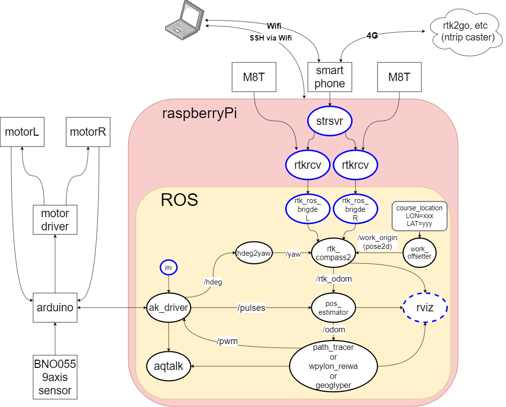

# gps_robotcar

For contest 2019,2020
 - https://robot-car.jimdofree.com/
 - https://youtu.be/MF5bkYhbCAs (2019)

Unfortunately, making these codes and machine were not in time for 2019.
In 2020 contest, this machine got upper places.

These codes and vehcle run with:
 - raspberry pi (3B tested, 2B,3B+ may go well)
 - Ubuntu MATE 18.04 + ROS melodic
 - RTKLIB 2.4.2 with neo-M8T x2
 - Arduino UNO/nano and BNO055(currently, codes for Arduino are not in repositry)

# video
 - https://youtu.be/2foByUpj73k (2020 presentation, currently Japanese only, sorry)
 - https://youtu.be/4AReDA8T_8c (2020 run)
 - https://youtu.be/TS_L8vSS0Tw (2020 prototype run)
 - https://youtu.be/2_SmIPHG9Vs (2019 run)
 - https://youtu.be/f0Gzboq7svk (rviz)
